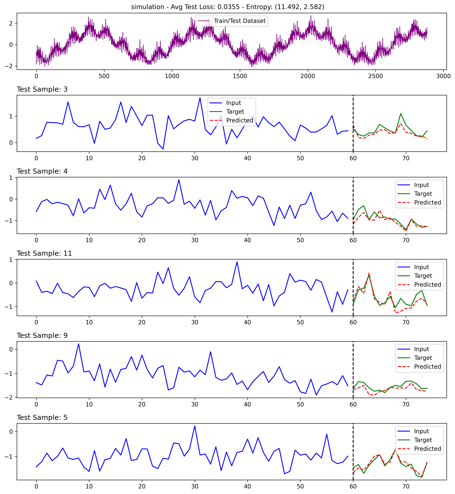

# Forecast con Transformer


Este repositorio ofrece un marco modular para la predicción de series temporales, donde se aprovecha la potencia de PyTorch para implementar un modelo Transformer personalizado capaz de capturar y procesar patrones complejos en datos secuenciales. Además, integra Optuna para la optimización automática de hiperparámetros, lo que permite ajustar eficientemente el proceso de entrenamiento y mejorar la precisión de las predicciones. Gracias a la generación de datos sintéticos y técnicas avanzadas de preprocesamiento, la herramienta facilita desde la experimentación hasta la visualización detallada de resultados, constituyéndose en una solución integral para proyectos de forecasting basado en aprendizaje profundo.

---

## Tabla de Contenidos

- [Forecast con Transformer](#forecast-con-transformer)
  - [Tabla de Contenidos](#tabla-de-contenidos)
  - [Descripción General](#descripción-general)
  - [Características](#características)
  - [Estructura del Proyecto](#estructura-del-proyecto)
  - [Documentación de Módulos](#documentación-de-módulos)
    - [src/forecasting.py](#srcforecastingpy)
    - [entrenar\_modelo\_y\_optimizar\_hiperparametros.py](#entrenar_modelo_y_optimizar_hiperparametrospy)
    - [visualizar\_hiperparametros.py](#visualizar_hiperparametrospy)
  - [Archivos de Configuración](#archivos-de-configuración)
  - [Instalación](#instalación)
  - [Uso](#uso)
  - [Visualización](#visualización)
  - [Contribuciones](#contribuciones)
  - [Licencia](#licencia)

---

## Descripción General

Este proyecto aprovecha las técnicas modernas de aprendizaje profundo para abordar los desafíos inherentes al forecasting de series temporales complejas. Al sintetizar datos con tendencias variables, patrones oscilatorios y ruido, el marco entrena un modelo basado en Transformer que puede predecir valores futuros con precisión. Además, se realiza la optimización de hiperparámetros utilizando Optuna, y las visualizaciones detalladas ayudan a analizar el rendimiento del modelo.

---

## Características

- **Generación de Datos Sintéticos:** Crea series temporales con tendencias, periodicidad y ruido configurables.
- **Modelo Transformer:** Una arquitectura Transformer personalizada adaptada para el forecasting de series temporales.
- **Procesamiento de Ventana Deslizante:** Convierte datos de series temporales continuas en secuencias de entrenamiento adecuadas.
- **Optimización de Hiperparámetros:** Utiliza Optuna para ajustar los parámetros del modelo y las configuraciones de entrenamiento.
- **Visualización:** Compara gráficamente entradas, objetivos y predicciones.
- **Calidad de Código Integrada:** Configurado con Black, Flake8 e isort para mantener una base de código limpia.
- **Hooks de Pre-commit:** Verifica automáticamente el estilo del código antes de los commits.

---

## Estructura del Proyecto

```
.
├── LICENSE                              # Archivo de licencia MIT
├── README.md                            # Este archivo README
├── pyproject.toml                       # Configuración para Black, Flake8 e isort
├── .pre-commit-config.yaml              # Configuración de hooks de pre-commit
├── src
│   └── forecasting.py                   # Módulo principal con funciones de generación de datos, modelo, entrenamiento y visualización
├── entrenar_modelo_y_optimizar_hiperparametros.py  # Script para entrenamiento y optimización de hiperparámetros usando Optuna
├── visualizar_hiperparametros.py        # Script para lanzar el dashboard de Optuna para análisis de hiperparámetros en tiempo real
└── figuras
    └── simulation.png                   # Imagen de salida de simulación de ejemplo
```

---

## Documentación de Módulos

### src/forecasting.py

Este módulo implementa la funcionalidad central del marco de forecasting:

- **Generación y Preprocesamiento de Datos:**
  - `generate_ts`: Crea datos de series temporales sintéticas con componentes de tendencia, ruido y periodicidad ajustables.
  - `rewrite_timestamps`: Reescribe las marcas de tiempo en un DataFrame para uniformidad.
  - `sliding_window`: Aplica un enfoque de ventana deslizante para segmentar la serie temporal para la entrada del modelo.

- **Dataset y Dataloader:**
  - `TimeSeriesDataset`: Dataset personalizado de PyTorch para convertir datos de series en tensores con una dimensión de características añadida.

- **Modelo Transformer:**
  - `TransformerModel`: Una arquitectura basada en Transformer que maneja tanto la codificación como la decodificación de secuencias de series temporales.
  - `TransformerForecaster`: Una extensión que envuelve el modelo y los procedimientos de entrenamiento.

- **Visualización:**
  - `visualize_predictions`: Carga el mejor modelo, genera predicciones para secuencias de prueba y visualiza la comparación entre datos de entrada, objetivo y predicción.

- **Flujo de Ejecución Principal:**
  - `main`: Orquesta todo el pipeline incluyendo generación de datos, optimización de hiperparámetros, entrenamiento, evaluación y visualización.

---

### entrenar_modelo_y_optimizar_hiperparametros.py

Este script se centra en:

- **Optimización de Hiperparámetros:**
  - Utiliza Optuna para explorar diferentes hiperparámetros de modelo y entrenamiento. Configura el estudio, gestiona los ensayos y guarda los mejores parámetros.

- **Procesamiento de Datos:**
  - Prepara los datos de series temporales sintéticas, los escala y aplica la técnica de ventana deslizante.

- **Entrenamiento y Evaluación:**
  - Inicializa el modelo de forecasting (`TransformerForecaster`).
  - Entrena el modelo durante las épocas especificadas.
  - Evalúa el rendimiento del modelo contra un conjunto de datos de prueba.
  - Registra información detallada y guarda el modelo con mejor rendimiento.

---

### visualizar_hiperparametros.py

Este módulo proporciona un dashboard interactivo para el análisis de hiperparámetros:

- **Dashboard de Optuna:**
  - Lanza un servidor web usando `optuna_dashboard` para proporcionar visualización en tiempo real del proceso de optimización de hiperparámetros.
  - Accede al dashboard en [http://localhost:8081](http://localhost:8081).

---

## Archivos de Configuración

- **pyproject.toml:**
  - Configura Black para el formateo automático del código.
  - Configura Flake8 para el linting y verificación del estilo del código.
  - Integra isort para asegurar un orden de importación estandarizado.

- **.pre-commit-config.yaml:**
  - Configura hooks de pre-commit para Black, Flake8 e isort. Estos hooks ayudan a hacer cumplir las verificaciones de calidad del código antes de los commits.

---

## Instalación

1. **Clonar el Repositorio:**

   ```bash
   git clone <repository-url>
   cd <repository-directory>
   ```

2. **Crear y Activar un Entorno Virtual:**

   ```bash
   python -m venv venv
   source venv/bin/activate  # Para Linux/MacOS
   venv\Scripts\activate     # Para Windows
   ```

3. **Instalar Dependencias:**

   Asegúrate de tener instalados los paquetes requeridos. Típicamente, incluyen:
   
   - Python (>=3.7)
   - PyTorch
   - Optuna
   - NumPy
   - Pandas
   - Matplotlib
   - scikit-learn
   - pyentrp

   Puedes instalarlos mediante:

   ```bash
   pip install -r requirements.txt
   ```

   *Nota: Crea un `requirements.txt` con las dependencias si aún no existe.*

---

## Uso

- **Entrenamiento y Optimización de Hiperparámetros:**

  Ejecuta el siguiente comando para generar datos, optimizar hiperparámetros y entrenar el modelo de forecasting:

  ```bash
  python entrenar_modelo_y_optimizar_hiperparametros.py
  ```

- **Visualización del Dashboard de Optimización de Hiperparámetros:**

  Para visualizar el progreso de la optimización con el Dashboard de Optuna, ejecuta:

  ```bash
  python visualizar_hiperparametros.py
  ```

  Luego, navega a [http://localhost:8081](http://localhost:8081) usando tu navegador web.

- **forecasting y Visualización:**

  El script de entrenamiento integra los procesos de forecasting y visualización. Después del entrenamiento, el mejor modelo se utiliza para predecir datos de series temporales de prueba, y se generan comparaciones visuales.

---

## Visualización

Al final del análisis, puedes ver una simulación de ejemplo (guardada en `figuras/simulation.png`) que demuestra los resultados del forecasting:



---

## Contribuciones

¡Las contribuciones, solicitudes de características e informes de errores son muy bienvenidos! Por favor, abre un issue o envía un pull request en GitHub.

---

## Licencia

Este proyecto está licenciado bajo la [Licencia MIT](LICENSE). Consulta el archivo LICENSE para más detalles.